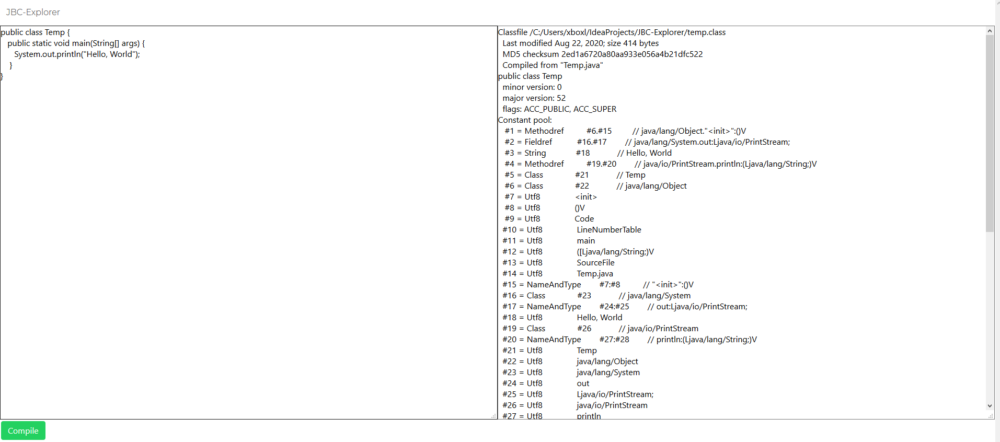

#Java Byte Code Explorer
I made this because I got tired of manually compiling Java through the command line to look at what the Java Compiler was doing.
I thought the Godbolt explorer would support something like this, but I was wrong, so I just quickly created my own.

## Example
